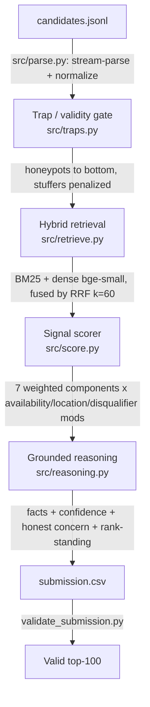

# Redrob Intelligent Candidate Ranker - Track 1

[](https://github.com/DhruvGoyal404/redrob-ranker/actions/workflows/ci.yml)
[](LICENSE)
[](https://www.python.org/)

Ranking the top-100 candidates for **"Senior AI Engineer - Founding Team"** out of a
100,000-profile pool - by *evidence of the right work*, not by who stuffed the most
AI keywords into their skills list.

> **The thesis.** The released JD says it plainly: *"The right answer is not to find
> candidates whose skills section contains the most AI keywords. A candidate who has
> all the AI keywords but whose title is Marketing Manager is not a fit. A Tier-5
> candidate may not use the word 'RAG' but if their career history shows they built a
> recommendation system at a product company, they're a fit."* So we score on
> **demonstrated, outcome-shaped evidence** read from career history, gated by a strict
> validity check, and modulated by whether the candidate is **actually available**.

---

## The magic moment (live demo)

**Sandbox:** https://redrob-rankers-indiaruns.streamlit.app/ (Streamlit Community Cloud)

Paste a JD → drop in a candidate sample → watch a ranked, **explained** shortlist
appear, each row with a confidence tag, the specific evidence behind it, honest
concerns, and any trap flags. Then open a candidate to see the full per-component
score breakdown.

```bash
streamlit run app/streamlit_app.py
```

---

## How it maps to the three required capabilities

| Required capability | Where it lives |
|---|---|
| **Deep Job Understanding** | `src/config.py` + `src/jd.py` encode the JD's *real* must-haves, explicit disqualifiers, and ideal-candidate band - not a keyword list |
| **Contextual Relevance** | `src/retrieve.py` - BM25 + `bge-small` dense embeddings fused with RRF; semantic match catches plain-language "Tier-5" candidates who never write the buzzwords |
| **Signal Integration** | `src/score.py` - the 23 `redrob_signals` enter as an availability modifier (recruiter response, recency, open-to-work, interview completion); profile + career metadata + behavior combined |

---

## Architecture



### The scorer (transparent, defensible weights - `src/config.py`)

Additive base (weights sum to 1.0):

| Component | Weight | What it rewards |
|---|---|---|
| `title_role_fit` | 0.22 | Holding (now or before) an ML/AI/IR role - the decisive anti-stuffer signal |
| `domain_evidence` | 0.24 | Retrieval/ranking/embeddings/vector-DB/eval evidence **read from career descriptions**, not skill names |
| `must_have_coverage` | 0.20 | The JD's "absolutely need" list (embeddings retrieval, vector DB, ranking eval, applied ML) |
| `semantic_similarity` | 0.14 | Dense JD↔profile match (hybrid retrieval) |
| `experience_band` | 0.08 | Peak 6-8y per the JD's "5-9 is a range" |
| `skill_trust` | 0.08 | proficiency × duration × **platform assessment** × endorsements (defeats lazy stuffing) |
| `nice_to_have` | 0.04 | LoRA/QLoRA, LTR, HR-tech, OSS |

Then multiplicative modifiers: **availability** (0.55-1.10 from `redrob_signals`),
**location** (Pune/Noida ↑, relocation-aware), and the JD's **disqualifiers**
(services-firms-only ×0.45, off-domain ×0.40, title-hopper ×0.80). Honeypots ×0.001,
stuffers ×0.05.

---

## Reproduce

```bash
pip install -r requirements.txt

# One-time offline pre-computation (embeddings cache; may exceed 5 min, GPU OK).
# Needs the heavy deps (torch/sentence-transformers), kept separate so the ranker
# and the demo stay light:
pip install -r requirements-precompute.txt
python precompute.py --candidates ./candidates.jsonl --artifacts ./artifacts

# The ranking step - CPU-only, no network, < 5 min, < 16 GB  (Stage-3 command)
python rank.py --candidates ./candidates.jsonl --out ./submission.csv --validate
```

`rank.py` imports **no torch and makes no network calls** - it loads the precomputed
vectors and rebuilds BM25 in-process. If the embedding cache is absent it degrades
gracefully to a BM25-only ranking so the pipeline always runs.

> **Data note.** `candidates.jsonl` is not committed (464 MB). Drop the file from the
> hackathon bundle into the repo root, then run the commands above.

### Reproduce via Docker (offline, CPU-only)

A `Dockerfile` reproduces the ranking step in a clean container with only the ranking
deps (`numpy` + `rank-bm25`, no torch). Verified to run with networking disabled:

```bash
docker build -t redrob-ranker .
docker run --rm --network none \
  -v "$PWD/candidates.jsonl:/app/candidates.jsonl:ro" \
  -v "$PWD/artifacts:/app/artifacts:ro" \
  -v "$PWD/out:/app/out" \
  redrob-ranker --candidates /app/candidates.jsonl --out /app/out/submission.csv --validate
```

Without the `artifacts` mount it still produces a valid BM25-only ranking. `make docker-build`
/ `make docker-run` wrap these.

### Tests

```bash
python -m pytest -q     # trap detection, ranking metrics, word-boundary matching, pipeline smoke
```

CI (`.github/workflows/ci.yml`) runs compile + tests on every push.

---

## Compute compliance

| Constraint | Limit | This pipeline |
|---|---|---|
| Runtime (ranking) | ≤ 5 min | **~85 s** on a 12-core laptop CPU (well under 2 min; ~120 s on a cold disk cache) |
| Memory | ≤ 16 GB | well under (streaming parse; ~2 GB peak) |
| Compute | CPU only | yes - no GPU, no torch at ranking time |
| Network | off | yes - no API calls; vectors precomputed |
| Disk (intermediate) | ≤ 5 GB | embeddings cache ~153 MB |
| Per-candidate LLM calls | none | none |

---

## Evaluation (honest, no hidden ground truth)

There is no public gold ranking, so we report two things and are explicit about what
each is worth:

- **Trap-catch rate - trustworthy** (we *know* the trap labels because we detect them
  by internal consistency). On the full 100K pool (68 honeypots, 3,876 stuffers
  detected): honeypots in top-100 = **0** (Stage-3 DQ is >10), honeypots in top-10 =
  **0**, stuffers in top-100 = **0**. Top-100 is **100% genuinely ML/AI/IR-titled**.
- **Silver-proxy NDCG/MAP/P@k - independent sanity check** (`eval/`): the relevance
  grade *within* the eligible band comes from **held-out recruiter-demand signals the
  ranker never uses as features** (`saved_by_recruiters`, `search_appearance`,
  `profile_views`), so it is not circular with our scoring. NDCG@10 **0.985**, NDCG@50
  **0.981**, MAP **1.00**, P@10 **1.00** (composite **0.987**). Honestly imperfect -
  recruiter demand also reflects popularity, not only JD-fit - and disclosed as such.

```bash
python -m eval.evaluate --candidates ./candidates.jsonl --submission ./submission.csv
```

We do **not** claim our pipeline matches a true gold ranking - none exists publicly -
but we quantify against a disclosed proxy and report the trap-catch numbers we *can*
stand behind.

### Fairness / proxy-skew audit (`src/fairness.py`)

We have no demographic labels, but proxies exist (city, college tier, employment
gaps). We check whether the top-100 over-selects on any proxy vs the eligible pool and
apply the four-fifths rule as a sanity check. We deliberately **do not** use
`education.tier` as a positive ranking feature and rely on demonstrated evidence
instead. We report the audit honestly - including residual skew - rather than claiming
"unbiased". This is what shipping a hiring model under NYC LL144 / Colorado SB 24-205
actually requires.

---

## What we tried and rejected

- **Sorting by AI-skill count / pure embedding similarity** - exactly the trap. The
  provided `sample_submission.csv` does this and ranks HR Managers and Graphic
  Designers at the top. Pure dense similarity also gets fooled by stuffed skill lists,
  so embeddings are one input among seven, not the ranker.
- **A learned ranker (LambdaMART)** - tempting, but with no real relevance labels we'd
  be training on guessed targets. A transparent weighted function is more defensible in
  the Stage-5 interview and easier to audit. LTR is noted as the productionization path
  once real recruiter-feedback labels exist.
- **Per-candidate LLM reasoning at ranking time** - forbidden by the compute
  constraint and unscalable; we assemble grounded reasoning from the score breakdown
  instead, which also eliminates hallucination.
- **Flagging "skill duration > career length" as a honeypot** - it fired on ~9% of the
  pool (the synthetic generator assigns skill durations independently), so it was noise,
  not an impossibility. Dropped in favor of clear contradictions only.

---

## Repo layout

```
rank.py            precompute.py        submission_metadata.yaml
src/    config jd parse features traps retrieve score reasoning fairness
eval/   metrics.py evaluate.py
app/    streamlit_app.py  presets.py
tests/  test_traps.py test_metrics.py test_features.py test_pipeline.py
data/   sample_candidates.json  candidate_schema.json
Dockerfile  requirements-rank.txt  Makefile  .github/workflows/ci.yml
```

## Future work
LambdaMART LTR on real recruiter-feedback labels; cross-encoder re-rank of the top-200;
continuous fairness monitoring; online A/B evaluation harness.
